# LAB 17 – Cracker OWASP Uncrackable Android Level 3

**Auteur :** Oumayma Benhilal  
**Cours :** Sécurité des applications mobiles  

## Objectifs d’apprentissage
À la fin de ce codelab, vous saurez :
- Décompiler et patcher une APK (code smali et logique Java).
- Analyser une librairie native (.so) avec un outil gratuit (Ghidra).
- Contourner les protections anti-debug, anti-Frida, anti-root et de vérification d’intégrité.
- Analyser statiquement un algorithme de chiffrement (XOR byte par byte) et calculer le mot de passe secret.
- Repackager, signer et installer une APK modifiée.

## Prérequis
- APK `UnCrackable-Level3.apk` téléchargée depuis le dépôt OWASP MSTG.
- Émulateur Android rooté ou appareil physique.
- Outils d'analyse : Jadx-GUI, apktool, Ghidra.
- Outils de build/déploiement : apksigner, adb.
- Python (pour le script de déchiffrement).

---

## Déroulement du Lab

### Étape 1 – Analyse statique simple avec Jadx-GUI (comprendre le Java)

On commence par récupérer l'APK cible :

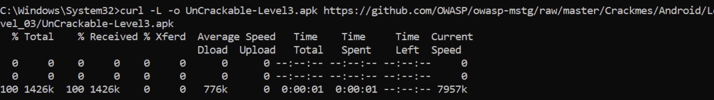

Puis on l'ouvre dans **Jadx-GUI**. On y découvre que l'application charge une librairie native `libfoo.so` et effectue plusieurs vérifications de sécurité. Par exemple, la méthode `verifyLibs()` calcule un CRC (CheckSum) de la librairie native et de `classes.dex`. Si l'intégrité est compromise, une variable `tampered` passe à `31337` :

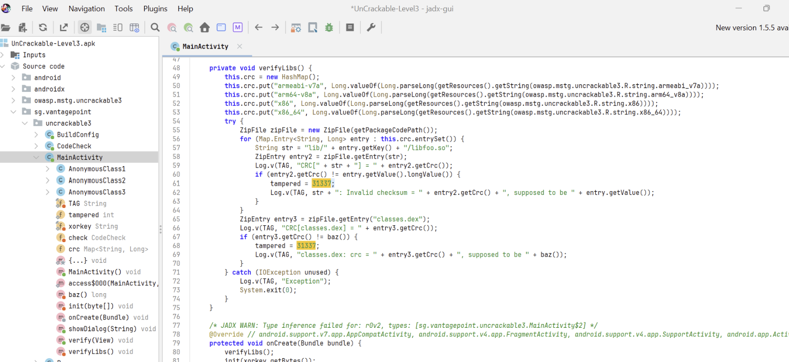

La méthode `verify(View)` fait ensuite appel à un objet `check` qui valide le code entré par l'utilisateur via une fonction native.

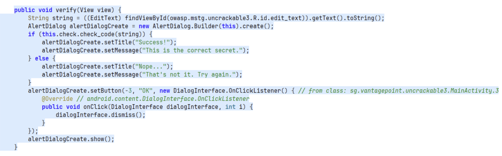

### Étape 2 – Décompiler l’APK avec apktool

Pour pouvoir modifier le comportement de l'application (et supprimer les pop-ups qui nous éjectent), il faut la décompiler :
```bash
apktool d UnCrackable-Level3.apk -o uncrackable3
```
On obtient alors le dossier contenant le code en `.smali`, les ressources, et les librairies natives (`lib/`).

### Étape 3 – Patch smali – Contourner l'anti-root et l'intégrité

En explorant le code décompilé (les fichiers `.smali`), on repère la chaîne de vérification qui déclenche des messages comme "Rooting or tampering detected." :

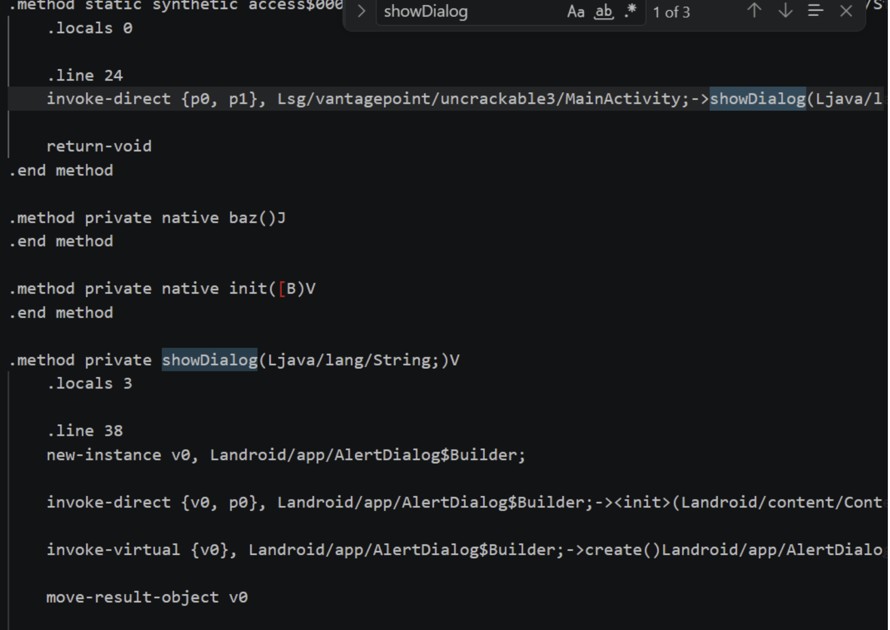

On constate que la classe principale appelle une série de fonctions (`checkRoot1()`, `checkRoot2()`, etc.) :

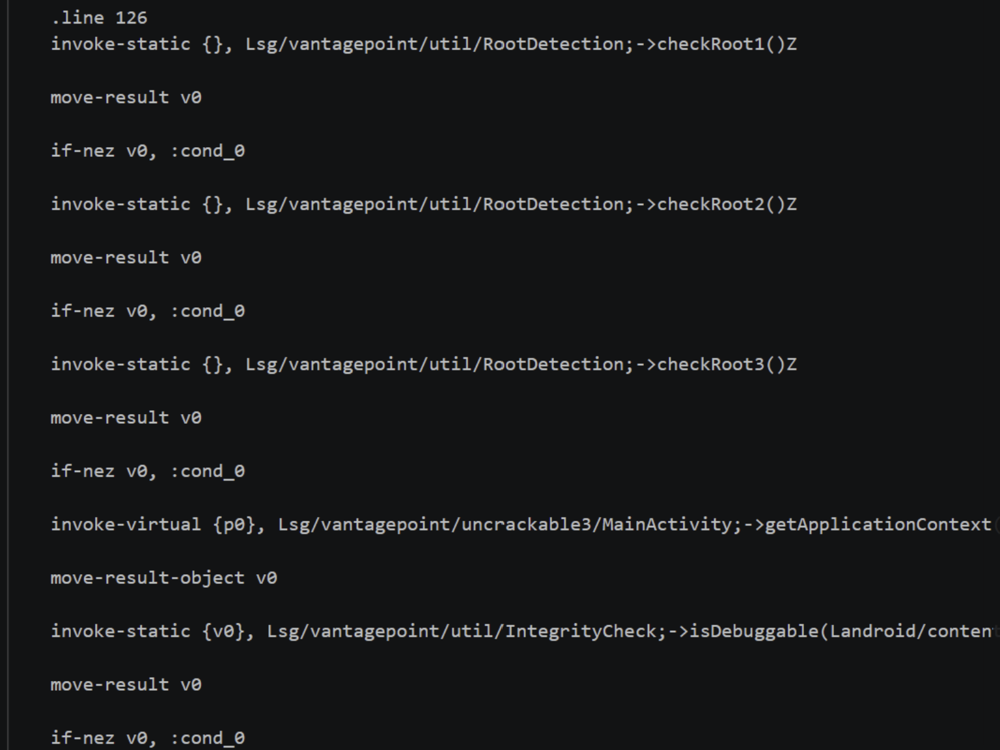

Pour éviter que l'application ne se ferme immédiatement, nous modifions ces méthodes dans le code `.smali`. L'une des solutions les plus simples est de forcer les méthodes de vérification à retourner vide (`return-void`), ou de contourner les blocs conditionnels (patch de `if-eqz` à `goto`).

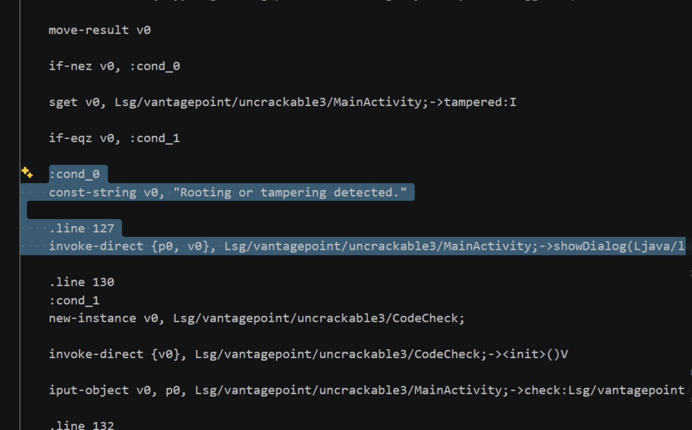
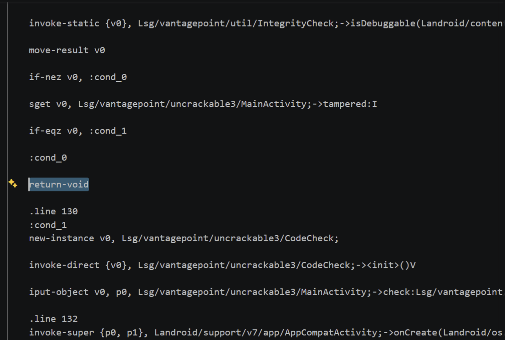

Une fois patchée, on recompile et on signe l'APK avec `apksigner` :

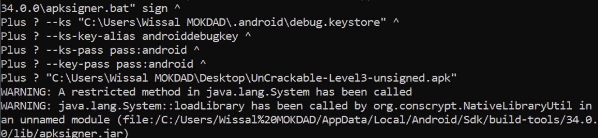

L'installation de l'APK modifiée se passe avec succès :

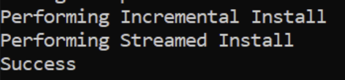

### Étape 4 – Patch de la librairie native avec Ghidra (Anti-Debug)

Même avec le code Java patché, la librairie native `libfoo.so` contient ses propres sécurités (anti-frida, anti-debug). 
Nous ouvrons `libfoo.so` dans **Ghidra**. L'interface nous montre l'arborescence des fonctions exportées, dont `Java_sg_vantagepoint_uncrackable3_CodeCheck_bar` :

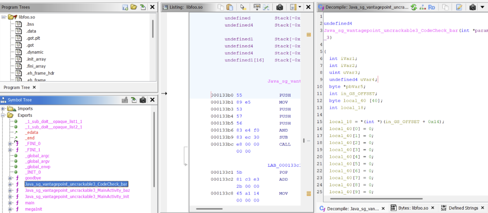

En analysant le code, on trouve également des routines d'initialisation suspectes manipulant la mémoire ou utilisant `ptrace` (ou cherchant des processus) pour se prémunir du debug.

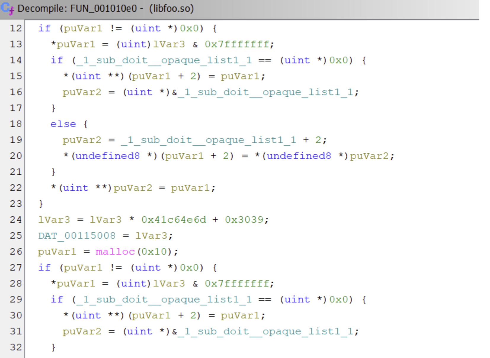

Si nous le souhaitions, nous pourrions patcher ces instructions (remplacer par des NOP) et réexporter la librairie pour utiliser Frida ou gdb dessus, bien que l'analyse statique seule nous permette d'avancer.

### Étape 5 – Analyser la logique native et calculer le mot de passe (XOR)

En analysant la fonction d'export `Java_sg_vantagepoint_uncrackable3_CodeCheck_bar`, la décompilation C (pseudo-code) de Ghidra révèle comment la vérification du mot de passe fonctionne.
La fonction compare l'entrée utilisateur à un buffer généré dynamiquement à l'aide d'un opérateur XOR (`^`).

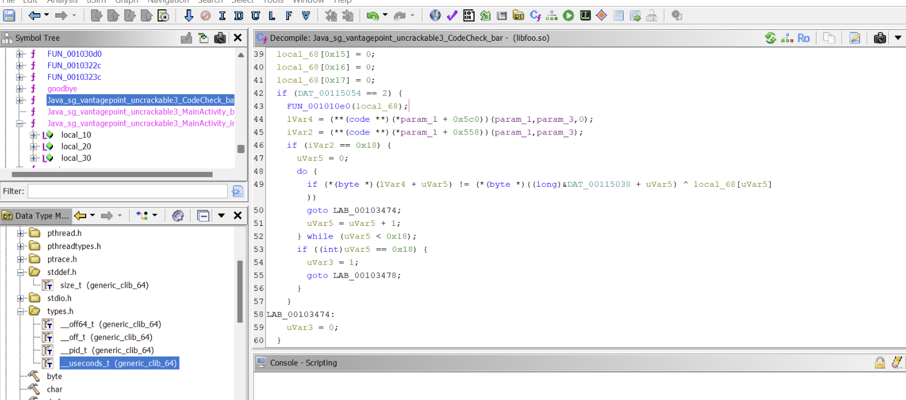

Nous extrayons la chaîne encodée et la clé XOR (la clé est `pizzapizzapizzapizzapizzapizza` qui est générée/répétée). Un simple script Python nous permet de recréer l'opération inverse :

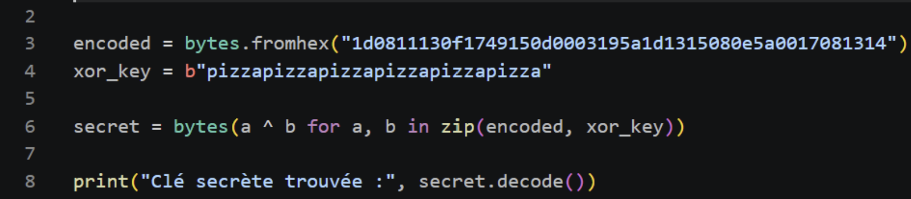

### Validation

On entre la clé calculée par notre script Python dans l'interface de l'application :

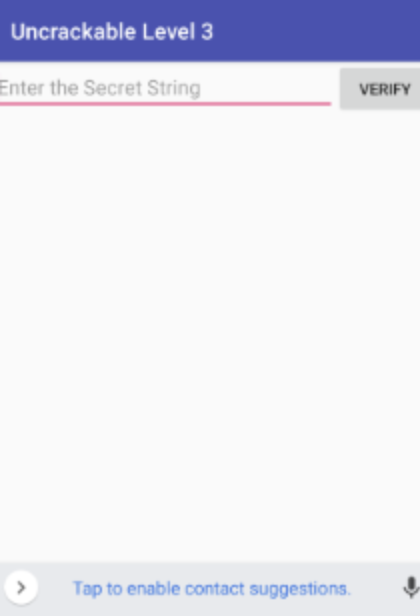

*Succès ! Le mot de passe correspond au secret.*

---

## Dépannage (FAQ)

- **Erreur : apktool ne veut pas recompiler** : Vérifiez que vous utilisez une version à jour d'apktool (v2.9.0+) et assurez-vous de ne pas avoir supprimé des lignes critiques (comme les `.locals` en smali).
- **L'application se ferme toujours au démarrage** : Assurez-vous d'avoir bien patché à la fois `checkRoot` ET `isDebuggable` ou l'intégrité (CRC).
- **Problème de signature** : Si votre APK modifiée ne s'installe pas, pensez à la signer avec `apksigner` ou `jarsigner` (utilisez un keystore de debug) et désinstallez l'ancienne version.

## Outils utilisés
- Jadx-GUI
- apktool & apksigner
- Ghidra
- Python

## Conclusion personnelle
Ce laboratoire Uncrackable Level 3 représente un vrai cap en termes de difficulté. Le passage de Java au code natif C/C++ avec Ghidra exige d'être méthodique. Le principal défi a été de s'y retrouver dans le pseudo-code généré pour l'algorithme XOR et de comprendre l'intrication des protections (l'app vérifie son propre code, l'environnement, et rend le debugging difficile). J'ai beaucoup appris sur la structure smali, le patch statique et l'extraction de clés depuis les librairies partagées.
